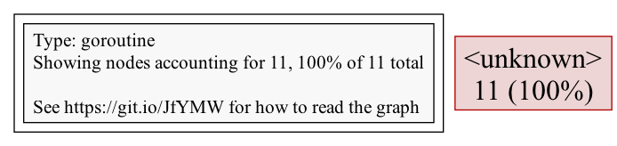

# Holmes example unknown issue

## Steps

``` shell
$ go mod tidy -v
$ go run -gcflags="all=-N -l" .

# run `curl http://localhost:10003/lockorder1` after 15s(warn up)
$ curl http://localhost:10003/lockorder1

# Got dump result in log file.
# 2024-03-06 11:23:43,156 [INFO] [Holmes] pprof goroutine profile write to file tmp/goroutine..20240306112343.156.log successfully

$ go tool pprof tmp/goroutine..20240306112343.156.log
Main binary filename not available.
Type: goroutine
Entering interactive mode (type "help" for commands, "o" for options)
```


